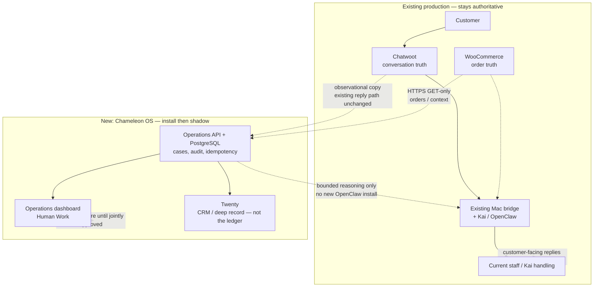
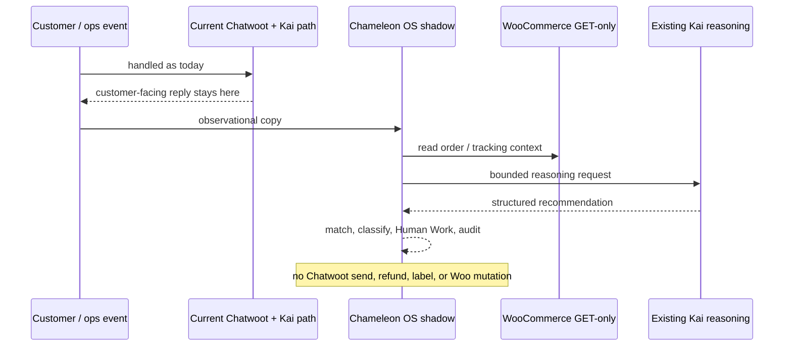

# Chameleon OS — Installation Architecture

Chameleon OS is added **beside** the live path. WooCommerce, Chatwoot, and Kai stay authoritative during the initial rollout. The new stack observes, records, and recommends. It does not reply or execute customer-facing actions during shadow mode.



## What is new on the host

- Chameleon Operations dashboard
- Chameleon API
- PostgreSQL operational database
- Twenty
- supporting integration workers
- health, backup, restore, and rollback tooling

The intended application exposure is loopback/private rather than a new public Chameleon application endpoint.

## What does not change during the initial install

- Chatwoot remains the customer-conversation truth.
- WooCommerce remains order/commerce truth.
- Kai/OpenClaw keeps its current live-support authority.
- The existing customer-facing reply path remains active.
- Production workflows are not moved merely because the new stack is installed.

## Shadow rule

A copy of an event may enter Chameleon OS for context, classification, reasoning, Human Work routing, and audit.

The live customer reply still leaves through the current Chatwoot/Kai path.

`SUPPORT_MODE=shadow` and `NO_EXECUTION` remain the intended boundary.



## Authority progression

```text
INSTALL
   ↓
VERIFY
   ↓
VIEW + SHADOW
   ↓
COMPARE REAL RESULTS
   ↓
JOINT REVIEW
   ↓
ENABLE ONE BOUNDED WORKFLOW
   ↓
MONITOR / ROLLBACK IF NEEDED
   ↓
EXPAND ONLY WHEN AGREED
```

There is no scheduled all-at-once cutover.
